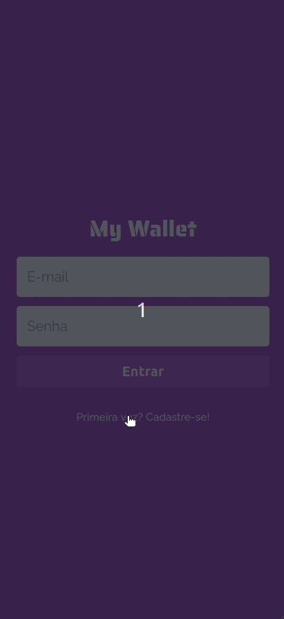

# MyWallet Backend

This is the backend API of a financial control application, where you can register your incomes and outgoings. You can see the frontend project [here](https://github.com/yasmimc/mywallet-frontend).

## Tolling

NodeJs 
Express 
Jest 
Supertest 

## Requirements

You must have installed node and npm.

## How to run:

First run `npm i` to install all dependencies.

Use the dump sql script to create your database structure.

Dump SQL script [here](https://github.com/yasmimc/mywallet-backend/blob/7f3892a21ded8ae38407682c31f5b48ca9f93e99/dump.sql).

And then create a .env.test file following as an example the .env.test.example file, setting the environment variables accordingly with data from your database.

The .env.test.example file [here](https://github.com/yasmimc/mywallet-backend/blob/7f3892a21ded8ae38407682c31f5b48ca9f93e99/.env.test.example).

In the project directory, you can run:

### `npm start`

Runs the app in the production mode.\
Open http://localhost:PORT, using the PORT that you have configured at .env.test file to view it in the browser.

### `npm run dev`

Runs the app in the development mode.\
Open http://localhost:PORT, using the PORT that you have configured at .env.test file to view it in the browser.

The page will reload if you make edits.\
You will also see any lint errors in the console.

### `npm run test`

Launches the test runner in the sequencial mode.

### `npm run test:watch`

Launches the test runner in the interactive watch mode.

### Deployment

This api is deployed on Heroku, you can visit it by accessing this [url](https://gratibox-project.herokuapp.com/).